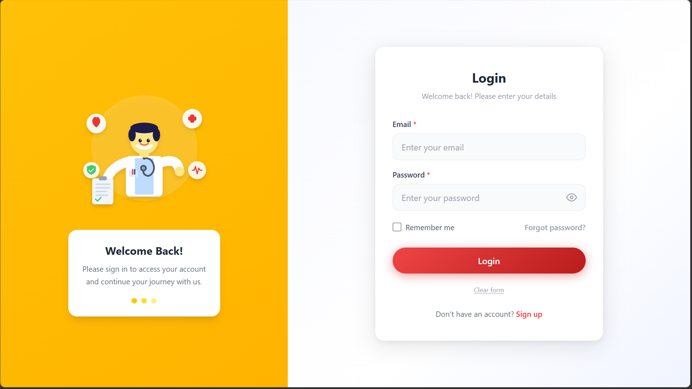

# HealthCare Login UI

A login page built with React + Tailwind CSS as part of a frontend assignment. 
The goal was to replicate a given mobile UI design and adapt it for a responsive web experience.

## Project Setup

This project was bootstrapped with Vite and includes React with Tailwind CSS for styling. The UI implements a clean, responsive login page with reusable components.

## Tech Stack

- React 19
- Vite
- Tailwind CSS v4
- React Router DOM

## Getting Started
```bash
npm install
npm run dev
```

Then open `http://localhost:5173`

## What I Built

- Split layout — yellow panel on the left, login form on the right
- Fully responsive (stacks on mobile)
- Email + password validation with inline error messages
- Password show/hide toggle
- Loading state on the login button
- Clear form button
- React Router set up for future pages

## Component Structure

The application follows a clean component architecture with separation of concerns:

**AuthLayout.jsx** — layout wrapper that splits the screen into the yellow left
panel and the white form side. Handles mobile stacking too.

**InputField.jsx** — reusable input that handles both text and password types.
Password one has the show/hide toggle built in. Validation error shows up below
the field.

**PrimaryButton.jsx** — button component, mainly built it separately so the
loading spinner logic stays out of the form code.

**Login.jsx** — puts it all together, owns the form state and validation.

## Project Structure

```
src/
├── components/
│   ├── AuthLayout.jsx
│   ├── InputField.jsx
│   └── PrimaryButton.jsx
├── pages/
│   └── Login.jsx
├── App.css
├── App.jsx
├── index.css
└── main.jsx
```

## Challenges I faced while building this (and how I fixed it)

**Tailwind v4 config** — I initially set it up like v3 (with tailwind.config.js 
and the @tailwind directives) and nothing was applying. Took me a bit to figure 
out that v4 works differently — just @import "tailwindcss" in the CSS and the 
Vite plugin handles the rest. Deleted the config file entirely once I understood this.

**Matching the design** — The original UI was a mobile app screenshot so adapting 
it to a desktop web layout needed some decisions around proportions and spacing. 
Went with a split screen approach which felt natural for login pages.

**Form validation UX** — Wanted errors to show on submit but clear as soon as the 
user starts fixing the field. Took a couple of tries to get the state logic right 
for that.

**Clearing errors on the right field** — when I first wrote handleChange, fixing 
the email field was also clearing the password error by accident. Took me a minute 
to realize I was spreading errors wrong. Fixed it by using the field name as a 
dynamic key so only that specific field's error clears on change.

**Double hover effect** — at one point I had a hover lift on the card AND the 
button both firing at the same time. So hovering the button would make the whole 
card jump too which looked really off. Removed the translate from the card and kept 
it only on the button.

**noValidate confusion** — I forgot to add noValidate to the form initially and 
the browser was showing its own validation popups before my custom errors could 
even fire. Took me embarrassingly long to figure out why my validation wasn't 
triggering properly on the first submit click. Added noValidate and it worked 
as expected after that.


## Preview



## Notes

- Sign up page not built yet — the link is there but routes back to login for now
- The login just simulates an API call with a setTimeout, no backend connected. 
